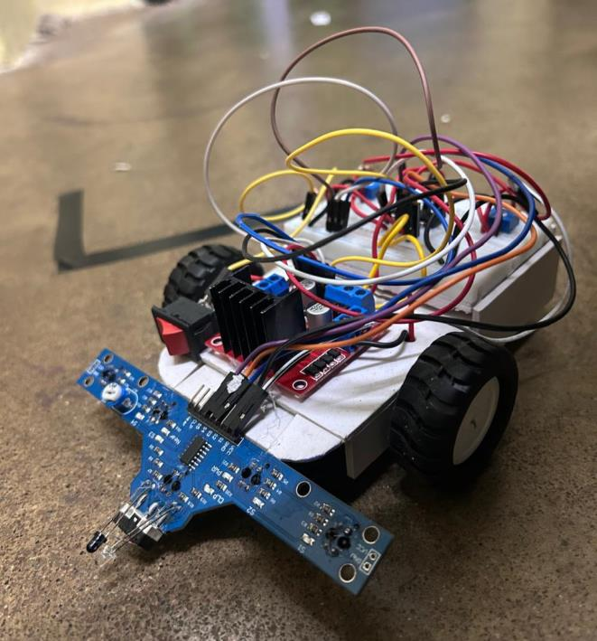

# Line Follower Robot Using Op-Amps

An analog line-following robot that detects and follows a black line on a white surface using IR sensors and op-amp comparators.
 **no microcontroller required**

## Overview

- This project demonstrates a fully analog approach to robotics control. 
- Instead of using a microcontroller to process sensor data, the robot relies on operational amplifiers (op-amps) configured as voltage comparators to make real-time steering decisions. 
- It's a low-cost, low-power solution ideal for learning core concepts in analog signal processing, sensor interfacing, and basic robotics.

## How It Works

- A BFD1000 IR sensor array continuously monitors the surface beneath the robot.
- White surfaces reflect IR light; black lines absorb it, creating a measurable voltage difference at each sensor.
- Each sensor's output is fed into an op-amp comparator (LM342/LM324), which compares it against a reference voltage set via potentiometers.
- The comparator's high/low output feeds into an L298N motor driver, which controls the left and right DC motors accordingly.
- Based on which sensors detect the line, the robot steers left, right, moves straight, or stops.

## Circuit Diagram

**Core components in the circuit:**
- LM342/LM324 op-amps configured as comparators
- L298N dual H-bridge motor driver
- BFD1000 5-channel IR sensor array
- 3× 10KΩ potentiometers (reference voltage adjustment)
- 2× DC motors
- 12V power supply

## Truth Table (Control Logic)
-------------------------------------------------------------------------------------------
| IR_L | IR_C | IR_R |       Condition        | Left Motor | Right Motor | Robot Action   |
|------|------|------|------------------------|------------|-------------|----------------|
|  0   |  1   |  1   | Line at left           |      0     |      1      | Turn left      |
|  1   |  0   |  1   | Line at center         |      1     |      1      | Move forward   |
|  1   |  1   |  0   | Line at right          |      1     |      0      | Turn right     |
|  0   |  0   |  1   | Between left & center  |      0     |      1      | Slight left    |
|  1   |  0   |  0   | Between center & right |      1     |      0      | Slight right   |
|  0   |  0   |  0   | Line under all sensors |      0     |      0      | Stop           |
|  1   |  1   |  1   | No line detected       |      1     |      1      | Search         |
-------------------------------------------------------------------------------------------

*(0 = line detected / sensor active, 1 = no line, based on comparator output logic)*

## Bill of Materials

See [`BOM.md`](BOM.md) for the full parts list with quantities and approximate costs.

## Features

- Pure analog control logic - no code, no microcontroller
- Compact, low-power, cost-effective design
- Reliable line tracking with accurate left/right/straight decisions
- Great foundation for extensions like speed control or obstacle detection

## Results

The robot successfully detected and followed a black line on a white surface, executing accurate left/right turns and maintaining a straight path when centered, with no lag or false triggering.

## Note on "Code"

This repository has **no firmware/code files** by design. All decision-making happens through analog comparator logic in hardware. 
If you're looking for the `.ino` or `.py` file, there isn't one; the "program" is the circuit itself.

## Future Improvements

- Add PWM-based speed control for smoother turns
- Integrate obstacle detection (ultrasonic sensor)
- Explore hybrid analog + microcontroller design for calibration ease

## Author

RAGHUL S
B.E- ECE(2023-2027)
Coimbatore Institute of Technology

## License

This project is licensed under the MIT License - see [`LICENSE`](LICENSE) for details.
